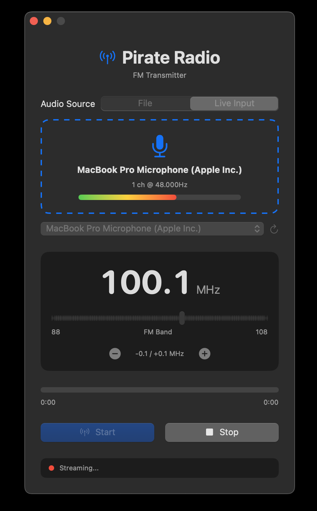

  

<h1 align="center">HackFM</h1>

  Broadcast audio files over FM radio using a <a href="https://greatscottgadgets.com/hackrf/one/">HackRF One</a> on macOS.

  

HackFM is a simple macOS app that lets you pick an audio file (WAV, MP3, AIFF) or stream live audio input, choose a broadcast frequency between 88.00 and 108.00 MHz, and start or stop transmission. A progress bar shows how much of the file has played.

## Requirements (macOS)

You’ll need a [HackRF One](https://greatscottgadgets.com/hackrf/one/) device. The app bundles `libhackrf` for both Intel and Apple Silicon, so end users do not need Homebrew.

If you need to rebuild the bundled library, see `third_party/hackrf/README.md` and run `scripts/build_hackrf_universal.sh`.

## Building

Open `hackfm/hackfm.xcodeproj` in Xcode and press Run.

## Legal note

FM transmission requires appropriate licensing in many regions. Use responsibly.

## License

This project is licensed under the [GNU General Public License v2.0](LICENSE).
